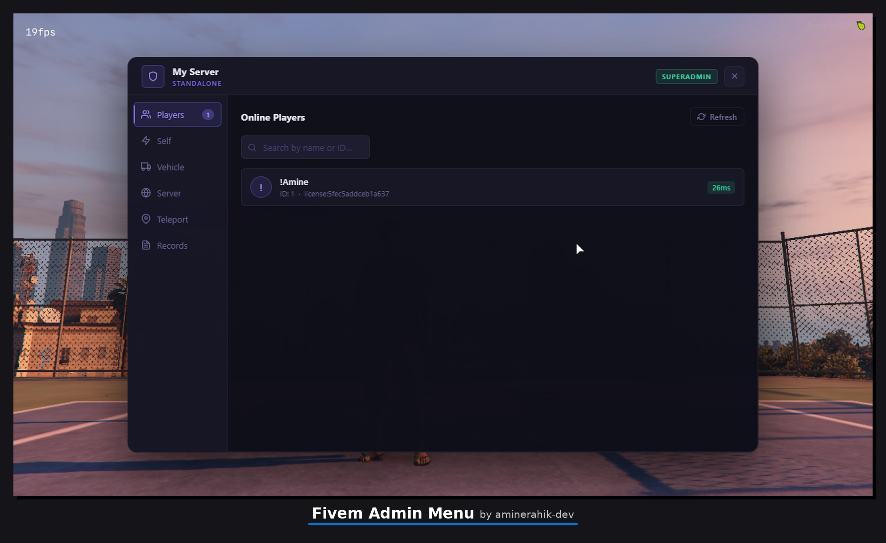
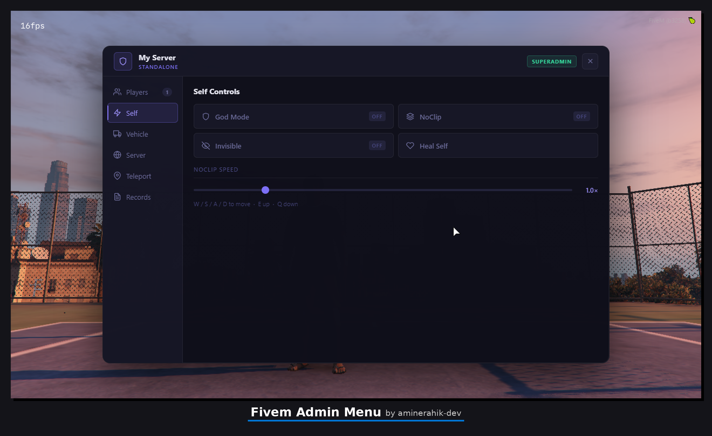
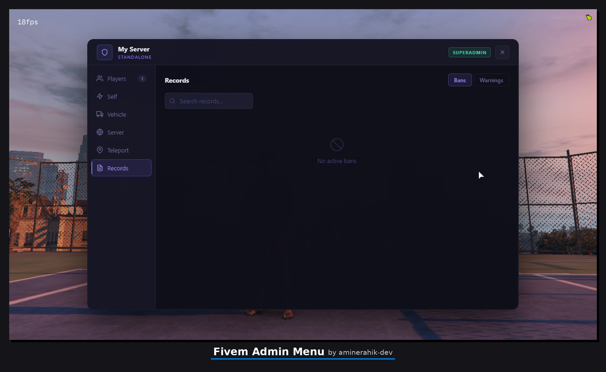
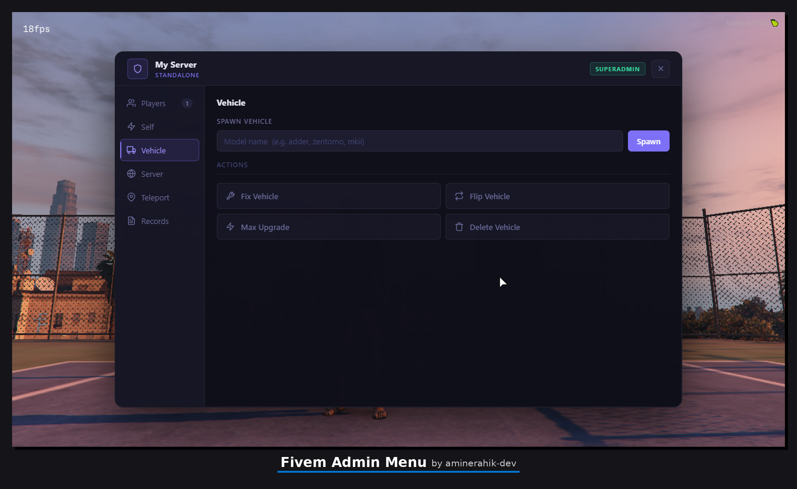
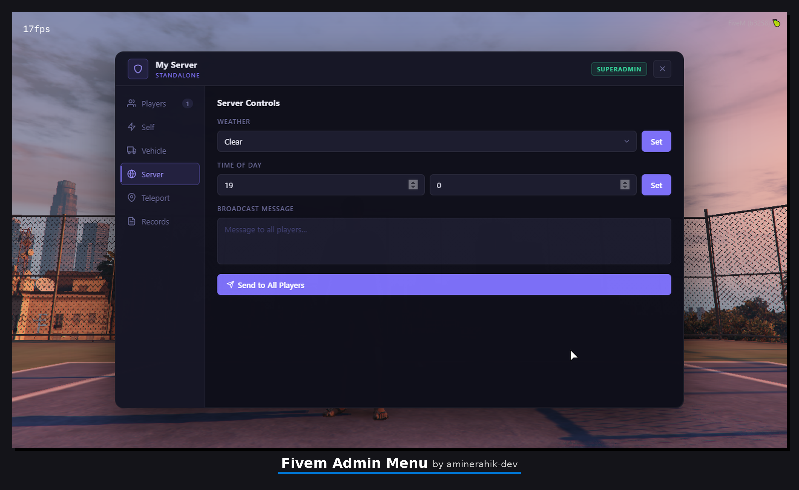

<div align="center">

# 🛡️ FiveM Admin Menu

**Professional multi-framework admin menu for FiveM roleplay servers.**

[](https://fivem.net/)
[](https://www.lua.org/)
[](LICENSE)
[]()

**ESX** • **QBCore** • **Standalone** — auto-detected at runtime, no manual config needed.

</div>

---

## 📋 Overview

A clean, dark-themed admin menu built for serious FiveM servers. No bloat, no third-party UI libraries. Full player management, 3-tier permission system, persistent ban records, and action logging — all in one resource.

→ [Jump to screenshots](#%EF%B8%8F-preview)

---

## 🖼️ Preview

<div align="center">

**Main Menu — Player List**


**Player Actions Panel**


**Self Controls**


**Records — Ban List**


**Vehicle Tools**


**Weather & Time**


</div>

---

## ✅ Features

### 👤 Player Management

- View all online players with real-time info (ID, name, identifier, ping)
- **Kick** — with reason logged
- **Ban** — persistent, reason required, stored in database or KvP fallback
- **Warn** — logged per player; configurable auto-kick and auto-ban thresholds
- **Mute / Unmute** — suppresses chat
- **Freeze** — locks player in place
- **Teleport to player** — jump to their position
- **Bring player** — pull player to your position
- **Spectate** — observe a player with full network validation
- **Revive** — bring a downed player back
- **Give weapon** — spawn a weapon into the player's inventory
- **Give money** — add funds (framework-aware)
- **Give items** — add inventory items (ESX/QBCore)
- **View player info** — identifiers, ping, coords, job, money

### 🧰 Self Controls

- **God mode** — toggle invincibility
- **Noclip** — fly freely through the map
- **Invisible** — hide from other players
- **Heal self** — full health and armor restore

### 🚗 Vehicle Tools

- Spawn any vehicle by model name
- Delete current vehicle

### 🌤️ World Controls

- Set weather (Clear, Rain, Thunder, Fog, Snow...)
- Set server time (hour / minute)
- Send server-wide announcements

### 📍 Teleport

- Teleport to player
- Teleport to coordinates (X, Y, Z input)

### 📁 Records

- **Ban list** — view, search, and manage all active bans
- **Warning list** — view warnings per player

### 📝 Commands

| Command               | Description     | Permission |
| --------------------- | --------------- | ---------- |
| `/kick [id] [reason]` | Kick a player   | Mod+       |
| `/ban [id] [reason]`  | Ban a player    | Admin+     |
| `/warn [id] [reason]` | Warn a player   | Mod+       |
| `/mute [id]`          | Mute a player   | Mod+       |
| `/unmute [id]`        | Unmute a player | Mod+       |
| `/revive [id]`        | Revive a player | Mod+       |

---

## ⚙️ Compatibility

| Framework      | Supported | Notes                      |
| -------------- | --------- | -------------------------- |
| **ESX**        | ✅        | Job & group detection      |
| **QBCore**     | ✅        | Permission group detection |
| **Standalone** | ✅        | ACE permissions only       |

Framework is auto-detected at startup — no config change needed when switching frameworks.

---

## 📦 Dependencies

| Dependency                                                             | Required    | Purpose                |
| ---------------------------------------------------------------------- | ----------- | ---------------------- |
| [FiveM Server](https://runtime.fivem.net/artifacts/fivem/) build 6116+ | ✅          | Runtime                |
| [oxmysql](https://github.com/overextended/oxmysql)                     | ❌ Optional | Persistent ban storage |
| ESX or QBCore                                                          | ❌ Optional | Framework integration  |

> **oxmysql** is disabled by default in `fxmanifest.lua`. To enable persistent MySQL ban storage, uncomment the `@oxmysql/lib/MySQL.lua` line. Without it, bans fall back to FiveM's native KvP automatically — no crash, no data loss.

---

## 🚀 Installation

### Step 1 — Download

**Option A — Git clone**

```bash
cd resources
git clone https://github.com/aminerahik-dev/FiveM-Admin-Menu
```

**Option B — Manual download**

Download the latest `.zip` from [Releases](../../releases), extract it, and place the folder inside your `resources` directory.

Make sure the folder is named exactly: `FiveM-Admin-Menu`

---

### Step 2 — Add to server.cfg

Open your `server.cfg` and add:

```cfg
ensure FiveM-Admin-Menu
```

> ⚠️ Place this **after** your framework resource (`ensure es_extended` or `ensure qb-core`).

---

### Step 3 — Set up permissions

This resource uses FiveM's native ACE permission system. Add the following to `server.cfg`:

**Permission nodes:**

```cfg
# Mod — basic moderation tools
add_ace group.mod  admin_menu.mod  allow

# Admin — full player management
add_ace group.admin  admin_menu.admin  allow

# Superadmin — unrestricted access
add_ace group.superadmin  admin_menu.superadmin  allow
```

**Assign players to groups:**

```cfg
# By license (Rockstar)
add_principal identifier.license:YOUR_LICENSE_HERE  group.superadmin

# By Steam hex
add_principal identifier.steam:110000XXXXXXXXX  group.admin
```

> 💡 **How to find your license identifier:** In-game, type `status` in F8 console. Your identifier appears in the player list.

---

### Step 4 — Configure (optional)

Edit `config.lua` to adjust defaults:

```lua
Config = {}

-- Auto-detected if set to "auto". Options: "auto" | "esx" | "qbcore" | "standalone"
Config.Framework = "auto"

-- Command to open the menu (set to nil to disable)
Config.Command = "adminmenu"

-- Warn thresholds
Config.WarnThresholds = {
    autokick = 3,   -- kick player after X warns
    autoban  = 5    -- ban player after X warns
}

-- Ban reasons (shown as quick-select in UI)
Config.BanReasons = {
    "Cheating / Hacking",
    "Toxic behavior",
    "Bug exploitation",
    "Ban evasion",
    "Other"
}
```

---

## 🔐 Permission System

Three permission tiers, each inheriting the level below:

| Level          | ACE Node                | Access                                           |
| -------------- | ----------------------- | ------------------------------------------------ |
| **Mod**        | `admin_menu.mod`        | Kick, warn, mute, revive, basic tools            |
| **Admin**      | `admin_menu.admin`      | Everything above + ban, give money/items/weapons |
| **Superadmin** | `admin_menu.superadmin` | Full access including records management         |

> Backward compatible with the legacy `admin_menu.open` ACE node.

---

## 📁 File Structure

```
fivem-admin-menu/
├── client/
│   └── main.lua              # Client-side NUI + local controls
├── server/
│   ├── main.lua              # Core server logic & event handlers
│   ├── database.lua          # oxmysql + KvP abstraction layer
│   ├── permissions.lua       # ACE + framework permission checks
│   └── logging.lua           # Action logging
├── html/
│   ├── index.html            # Menu structure
│   ├── style.css             # Dark theme UI
│   └── script.js             # NUI logic + permission gating
├── config.lua
├── fxmanifest.lua
└── README.md
```

---

## 🛠️ Troubleshooting

**All players show as Mod rank regardless of their group**

- Root cause is malformed ACE syntax in `server.cfg` — FiveM's parser is strict about spacing
- Verify your lines match exactly: `add_ace group.admin admin_menu.admin allow` (single space between each token, no tabs)
- After editing `server.cfg`, run `restart FiveM-Admin-Menu` in the server console — a full server restart is not required
- Use `test_ace [player_id] admin_menu.superadmin` in the server console to confirm the correct node resolves

**Menu doesn't open**

- Confirm `ensure FiveM-Admin-Menu` is in `server.cfg`
- Check F8 console for errors on resource start
- Verify your ACE node is correctly assigned (`add_principal` line matches your identifier)

**Permission denied / menu opens but actions are blocked**

- Make sure the correct ACE node is assigned (`admin_menu.mod`, `.admin`, or `.superadmin`)
- Run `test_ace [player_id] admin_menu.admin` in the server console to verify ACE is active

**Bans not persisting after server restart**

- Without `oxmysql`: bans use KvP — data persists per server instance but may not survive full wipes
- With `oxmysql`: ensure the resource starts before `fivem-admin-menu` and the DB connection is healthy

**Spectate crashes or kicks me**

- This is a known FiveM issue when spectating players with unsynced network objects
- The resource includes a network validation guard — if it still occurs, the target player may have a bad sync state; try spectating someone else first

**`NetworkGetEntityFromNetworkId` warning in console**

- Non-critical. Happens when a player's vehicle netId is 0 (not yet spawned/synced). Guarded in the code — safe to ignore.

---

## 📄 License

MIT — free to use, fork, and modify. Credit is appreciated but not required.

---

<div align="center">

Made by [Amine](https://github.com/aminerahik-dev) • Built for FiveM server owners who need real tools, not bloat.

</div>
